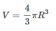

# Длинное целое

Ограничение времени	1 секунда

Ограничение памяти	64Mb

Ввод	стандартный ввод или input.txt

Вывод	стандартный вывод или output.txt

В физике часто встречаются задачи, в которых несколько маленьких капелек сливаются в 
одну большую, и, соответственно меняются какие-то их общие характеристики – радиус, 
потенциал, напряженность поля, если капельки заряжены.

Напишите программу, которая по введённому радиусу маленькой капельки и количеству капель 
рассчитает радиус большой капли. Округлять не нужно.

## Формат ввода
Вводятся два целых числа – радиус капельки и количество капель.

## Формат вывода
Выведите радиус капли, получившейся после слияния всех маленьких.

### Пример

| Ввод | Вывод |
|------|-------|
| 1    | 10.0  |
| 1000 |       |

## Примечания
Формула объема шара

