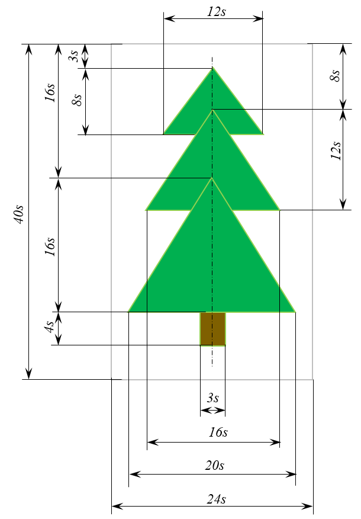
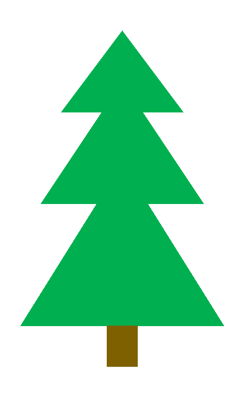

# Маленькая елочка

Нарисуйте маленькую, или не очень маленькую, елочку в зависимости от введенного масштаба по образцу. Контур у фигур показан для облегчения восприятия, рисовать его не нужно.

Фон изображения белый, зеленый цвет – #00b050, коричневый #7f6000.

**Ввод**

Вводится целое число – характерный размер `s` изображения.

**Вывод**

Полученный рисунок сохраните в файл `fir_tree.png`.

**Пример**

```
20
```
`Результат работы:`
