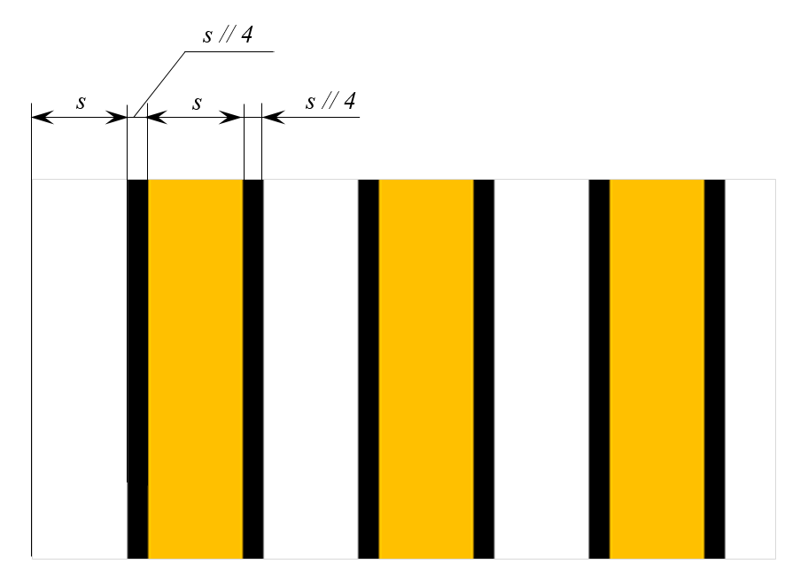
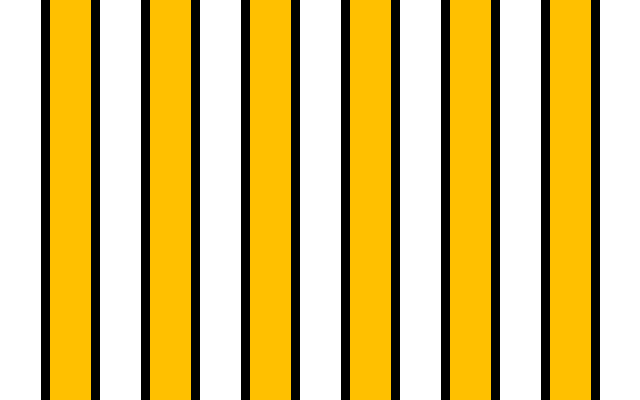

# Пешеходный переход

Весной принято обновлять полоски на пешеходных переходах. Напишите программу, которая нарисует пешеходный переход по введенным размерам.

Размеры изображения – сначала ширина, затем высота – и ширина полосы вводятся через пробел.
Фон картинки черный, полоски рисуются в виде прямоугольников во всю высоту картинки, начиная с левого края с белой полосы и чередуются с желтыми цвета (255, 192, 0). Между полосками остаются промежутки асфальта шириной в четверть закрашенной полосы. Сохранить изображение нужно в файл `crossing.png`.

**Размеры и расположение полос:**

*   `s` – ширина цветной полосы


**Пример**

```
640 400 40
```

**Результат работы:**

