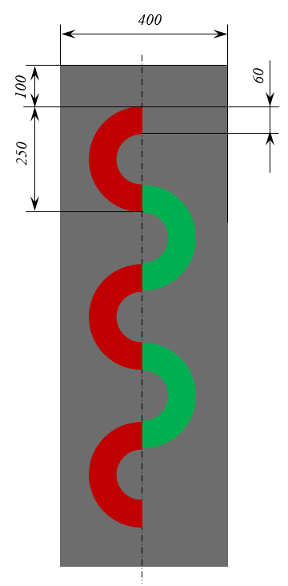

# Цветная змейка

С помощью программы нужно нарисовать змейку, примерно такую, как на схеме. Только количество правых полуколец заранее неизвестно. И цвет. Ширина полосы и ее цвет (#777) известны. Также известно расположение правых полуколец относительно краев картинки. Левые полукольца соединяют правые, поэтому их количество и расположение тоже понятны.



Отступы по вертикали от змейки до края картинки снизу и сверху одинаковы.

Итак, вводится количество левых полуколец, затем их цвет в 16-ричном формате, затем в таком же формате вводится цвет правых полуколец.

Нарисуйте картинку и сохраните в файл `colored_snake.png`.

Для рисования полукольца можно использовать инструмент `arc` с заданной толщиной.

## Пример

```
3
#c00000
#00b050
```

**Результат работы:**

