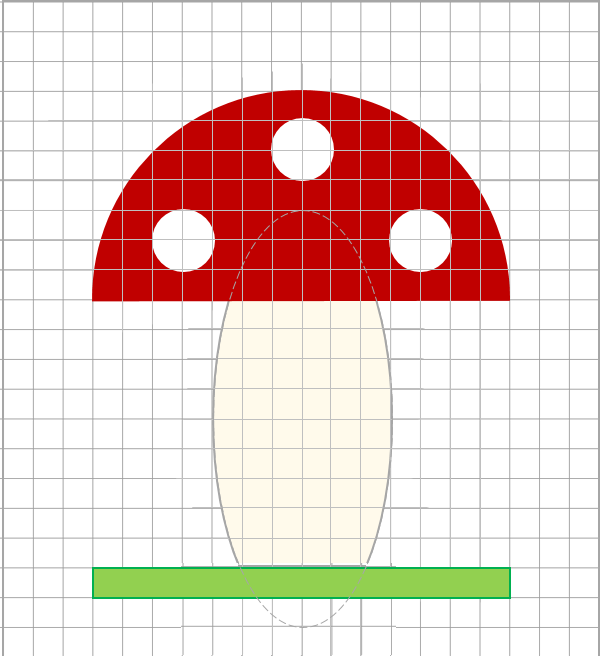

# Мухомор

Нарисуйте картинку с мухомором 20x22 клеточки в указанном масштабе. Контура у фигур нет, контур пунктиром показан для определения размеров фигуры.



**Цвета:**

*   Цвет шляпки – 192, 0, 0
*   Цвет ножки – 255, 250, 235
*   Цвет точек на шляпке – 255, 255, 255
*   Трава – 146, 208, 80

**Ввод:**

*   Цвет фона – три компоненты цвета через пробел.
*   Размер клеточки – целое число.

**Вывод:**

Сохраните полученное изображение в файл `mushroom.png`.

**Пример:**

```
255 255 255
20
```
