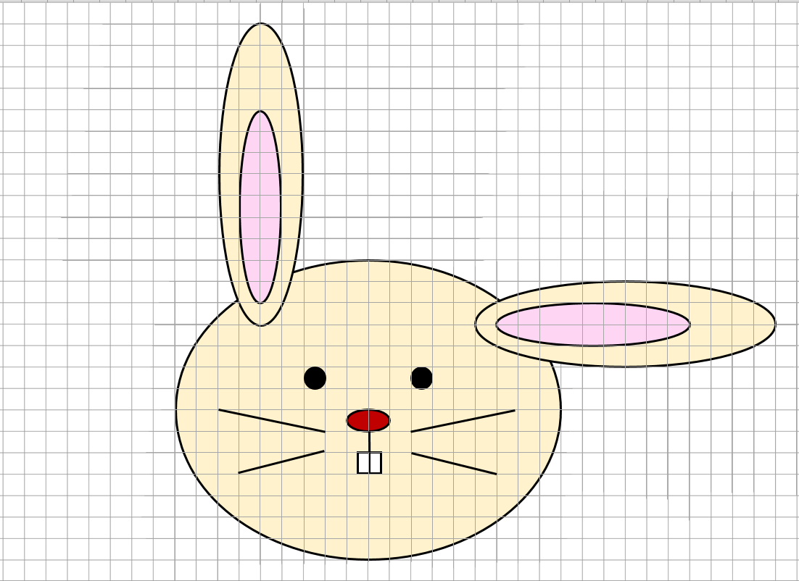
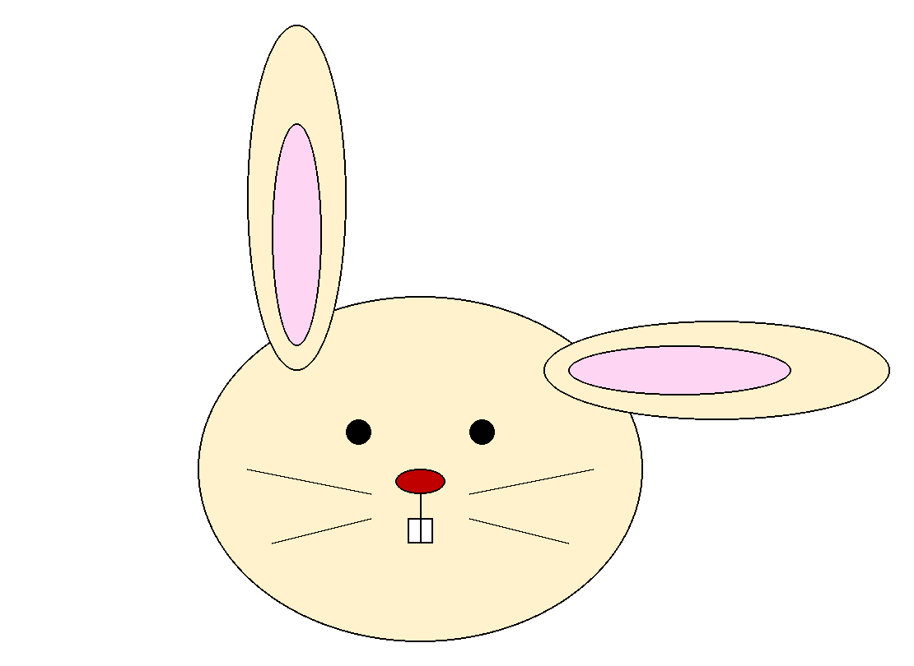

# Зайка

Он такой милый! Напишите программу, рисующую зайчика, масштаб отдельных частей задан клетчатым полем.



## Детали

*   Размер картинки – 37 клеток по горизонтали и 27 по вертикали.
*   Контур фигур черный, толщина 2 пикселя.

## Цвета

*   Желтый – 255, 242, 204
*   Розовый – 254, 214, 244
*   Красный – 192, 0, 0

## Дополнительно

*   Ширина зуба – половина клетки.
*   Вводится масштаб – какому количеству пикселей соответствует одна клеточка изображения.
*   Сохраните картинку в файл `cute_bunny.png`.

## Пример

**Ввод:**

```
20
```

**Результат работы:**

