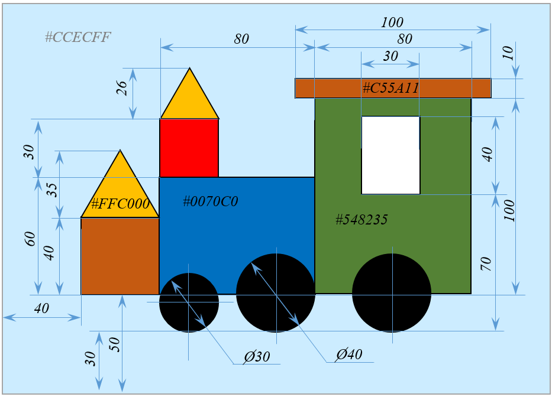
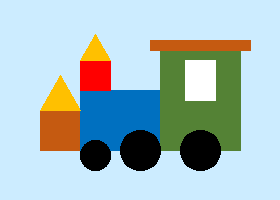

# Паровозик

**Ограничение времени:** 1 секунда

**Ограничение памяти:** 64Mb

**Ввод:** стандартный ввод или `input.txt`

**Вывод:** стандартный вывод или `output.txt`

Нарисуйте паровозик по размерам и цветам, указанным на рисунке. Размер рисунка 280х200.

Для этого напишите функцию `train()`, принимающую имя файла для сохранения.

**Дополнительные указания:**

*   то, что кажется квадратом, и есть квадрат;
*   то, что выглядит кругом, круг и есть;
*   то, что кажется красным, белым или черным, им и является;
*   треугольники равносторонние;
*   левый конец диаметра маленького колеса находится на одной прямой с левой стороной синего прямоугольника;
*   правый конец диаметра среднего колеса совпадает с правым нижним углом синего прямоугольника;
*   правое колесо имеет такой же размер, что и среднее; расположено посередине стороны зеленого прямоугольника;
*   контура у фигур и у рисунка нет.



**Формат ввода**

**Пример вызова функции:**

```
train("out.png")
```

**Формат вывода**
```Файл out.png```
