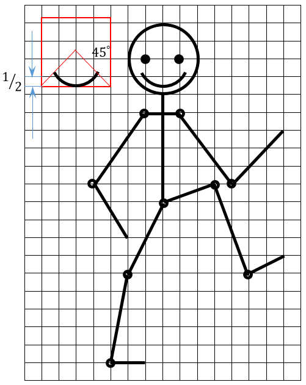
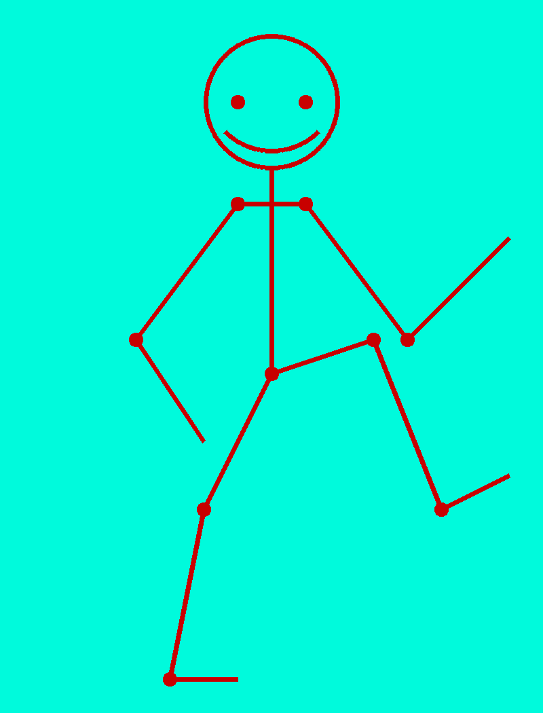

# Точка, точка, запятая

**Ограничение времени:** 1 секунда

**Ограничение памяти:** 64Mb

**Ввод:** стандартный ввод или `input.txt`

**Вывод:** стандартный вывод или `output.txt`

Минус, рожица кривая.
Палка, палка, огуречик,
Вот и вышел человечек.

Нарисуйте человечка по образцу. Для этого нужно написать функцию `human()`, принимающую цвет фона, цвет линии, масштаб – размер одной клетки изображения в пикселях – и толщину линии. Нужно на полотне 16х21 клетку нарисовать человечка в указанном на рисунке масштабе. Клетки и дополнительные построения изображать не нужно. Полученную картинку сохранить в файл `human.png`.

Как построить и расположить рот человечка, поясняется на врезке слева (квадрат со стороной 4 клетки, верхний левый угол в точке (клетка, пол клетки)). Каждый сустав и глаза человечка – это круг радиуса 1/5 от размера клетки (деление нацело), суставы не залиты, глаза залиты.



## Формат ввода

Пример вызова функции:

```python
human('#00fAdc', (200, 0, 0), 50, 7)
```

## Формат вывода

Файл `human.png`

