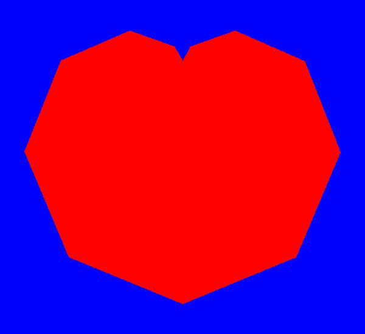

# Кардиоида

**Ограничение времени:** 1 секунда

**Ограничение памяти:** 64Mb

**Ввод:** стандартный ввод или `input.txt`

**Вывод:** стандартный вывод или `output.txt`

Кардиоида – кривая, напоминающая сердце. Ее уравнение в декартовых координатах выглядит так:

*   x = 2rsin(t) + rsin(2t)
*   y = 2rcos(t) + rcos(2t)

где *t* – параметр, значения которого меняются от 0 до 2π.

Напишите функцию `cardioid()`, принимающую аргументы: параметр *r* и параметр *step* – на основе которого определяется шаг изменения параметра *t*: он равен π/*step*.

На чисто синем холсте размером 600 на 550 пикселей, сдвинув начало рисования в точку (300, 200) (направления осей остаются прежними – *x* вправо, *y* вниз), нужно нарисовать кардиоиду, вычисляя значения последующих координат и соединяя точки ломаной линией. Внутреннюю часть залить чистым красным цветом, результат нужно сохранить в файл `cardio.png`.

## Формат ввода

Пример вызова функции:

```
cardioid(100, 6)
```

## Формат вывода

Файл `cardio.png`

