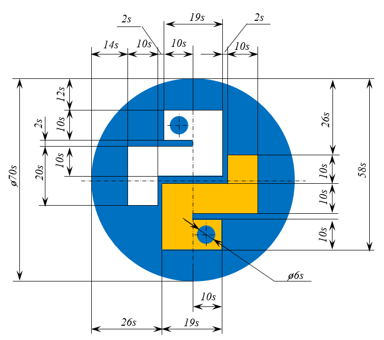

# Эмблема Python

Нарисуйте стилизованную эмблему Python в заданном масштабе.

## Условия

*   Характерный размер `s` вводится.
*   Размер картинки `70s x 70s`, фон белый.
*   Цвет кругов: `0, 112, 192`.
*   Цвет верхней змейки: белый (`255, 255, 255`).
*   Цвет нижней змейки: `255, 192, 0`.
*   Готовое изображение сохраните в файл `python_logo.png`.

## Пример

### Ввод

```
10
```

### Результат работы:


