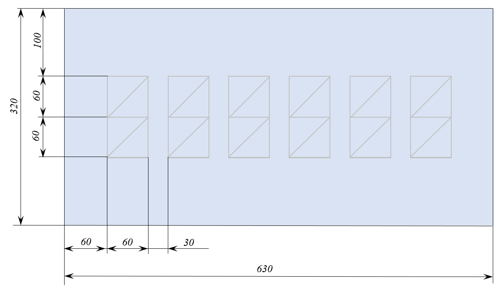
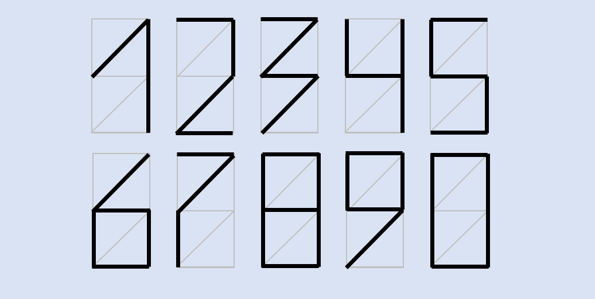
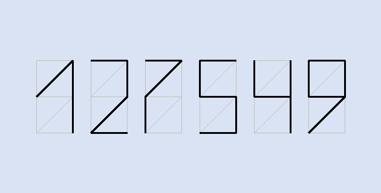

# Индекс

Напишите программу, автоматически подписывающую индекс на конверте по клеточкам по образцу.

## Описание

Индекс представляет собой 6-значное число. Места для записи цифр нужно нарисовать тонкими в 1 пиксель серыми (#bfbfbf) линиями, сами цифры – черными линиями толщиной 3 пикселя. Размер конверта и расположение индекса показаны на схеме.

## Входные данные

Вводится цвет фона и индекс – 6-значное число.

## Выходные данные

Готовое изображение сохраните в файл `index.png`.

## Пример

**Ввод:**

```
#dae3f3
127549
```

**Результат работы:**

