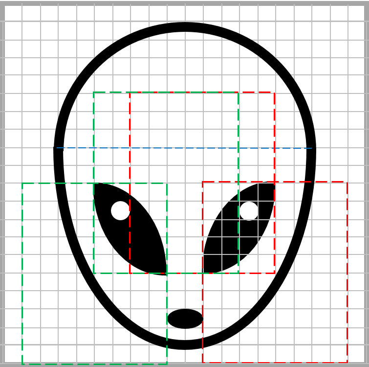

# Инопланетянин

Нарисуйте инопланетянина, используя только дуги и эллипсы. На схеме показаны их размеры и расположение. На рисунке использовано только два цвета – черный и белый.

## Уточнения

*   Размер рисунка – 20s x 20s.
*   Место разделения верхней и нижней дуг показано голубой пунктирной линией. Каждая из дуг представляет собой половину соответствующего эллипса, толщина линии – 0,6s (не забудьте округлить до целых!).
*   Каждый глаз составлен из двух хорд, для правого глаза их эллипсы показаны красными пунктирными линиями, для левого – зелеными.

## Ввод

Вводится масштаб – количество пикселей в одной клеточке.

## Вывод

Сохраните построенное изображение в файл `alien.png`.

## Пример

**Ввод:**

```
20
```

**Результат работы:**

