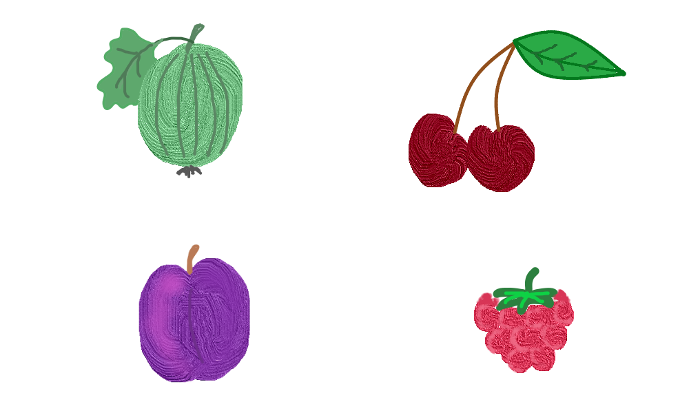

# Ягодный круговорот

В ягодах главное что? Главное – порядок, в котором их нужно есть!

Вашему решению доступен файл `fruits.png` с картинкой. Переставьте ягоды в заданном порядке. Для этого картинку с четырьмя ягодами разрежьте на 4 равные части и переставьте их в порядке введенных цифр. Расположение частей – слева направо и сверху вниз.


(На исходном изображении вишня идет под номером 1, малина – 2, крыжовник – 3, слива – 4. Тогда, если ввести `3142`, то в верхнем ряду слева будет крыжовник, справа вишня, в нижнем слева слива, справа малина.)

Сохраните изображение в файл `cycle.png`.

**Пример**

```
3142
```

**Результат работы:**

