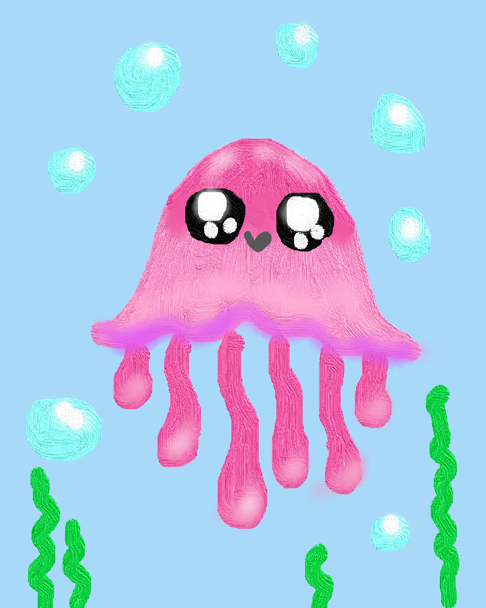
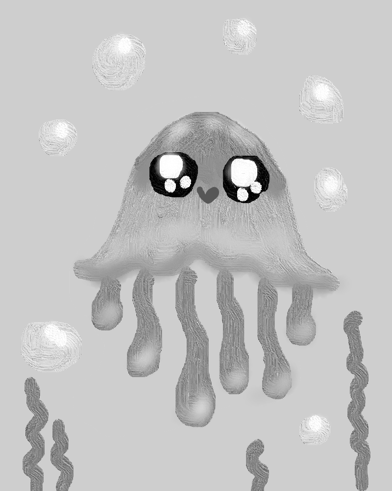

# Веселая медуза

Напишите программу, которая изменит цвета изображения веселой медузы на оттенки серого. В цветовой модели RGB цвет будет серым, если все компоненты имеют одинаковое значение. Это значение нужно рассчитать так: каждую составляющую цвета пикселя умножить на определенный коэффициент. Значения коэффициентов вводятся, они представляют собой вещественные числа.

Например, если введены числа `0.299`, `0.587`, `0.114`, то все три компоненты цвета пикселя будут равны значению `R * 0.299 + G * 0.587 + B * 0.114`

Не забудьте округлить значения до целых, используя `int`!

Изображение для изменения находится в файле `jellyfish.png`, доступном вашему решению.

**Входные данные:**

Коэффициенты для RGB (вещественные числа).

**Выходные данные:**

Готовое изображение сохраните в файл `gray_jelly.png`.

**Пример**

```
0.299
0.587
0.114
```

**Результат работы:**

