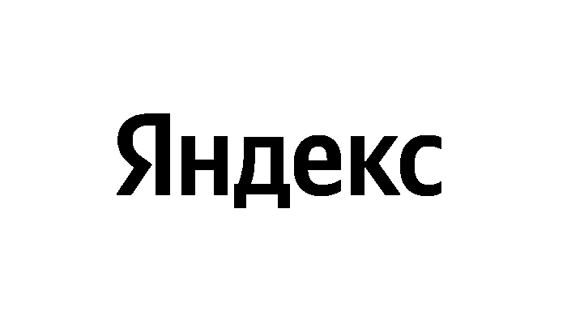

# Логотип Яндекса

Вам поступил срочный заказ – нужно перекрасить буквы на логотипе Яндекса. Только заказчик еще не решил – красную букву перекрасить в черный цвет или черные в красный? Ждать некогда, напишите программу, которая прочитает введенное слово (`red` или `black`) и в первом случае закрасит все буквы в цвет, которым сейчас окрашена первая буква (255, 0, 0), а во втором – все в черный.

Логотип находится в файле `yandex_logo.png`, доступном вашему решению.

## Входные данные

Вводится слово.

## Выходные данные

Сохраните перекрашенный логотип в файл `ready.png`.

## Пример

**Ввод:**

```
black
```

**Результат работы:**

