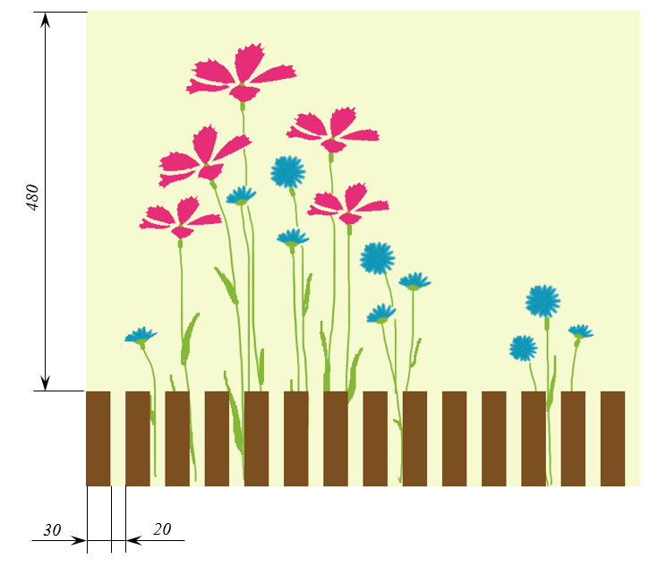
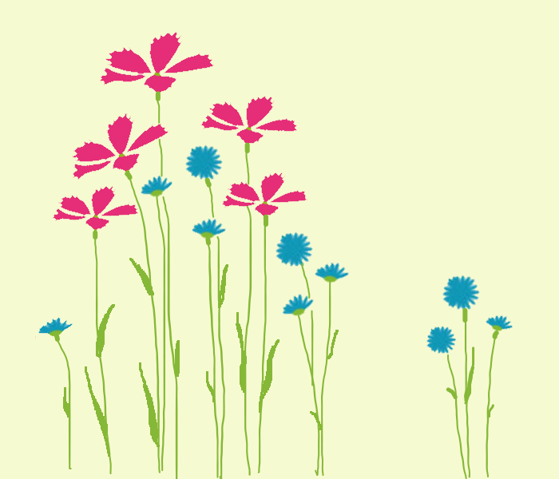
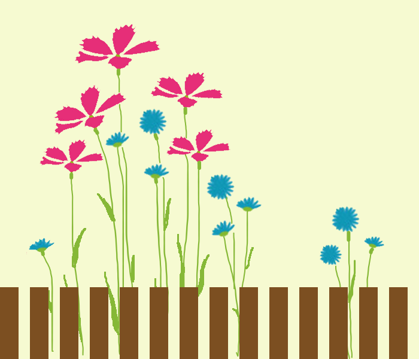

# Забор

В саду выросли прекрасные цветы. Помогите огородить их заборчиком, чтобы никакие козы не смогли их съесть. Цвет забора вводится в виде строки, все планки одинаковые, без контура, размеры и расположение указаны на схеме.

## Схема

schema

Файл с цветами `flowers.png` доступен вашему решению.

## Исходные данные

Вводится строка цвета забора.

## Выходные данные

Готовый файл с забором сохраните в файл `fence.png`.

## Пример

**Ввод:**

```
#7c4f21
```

**Результат работы:**

