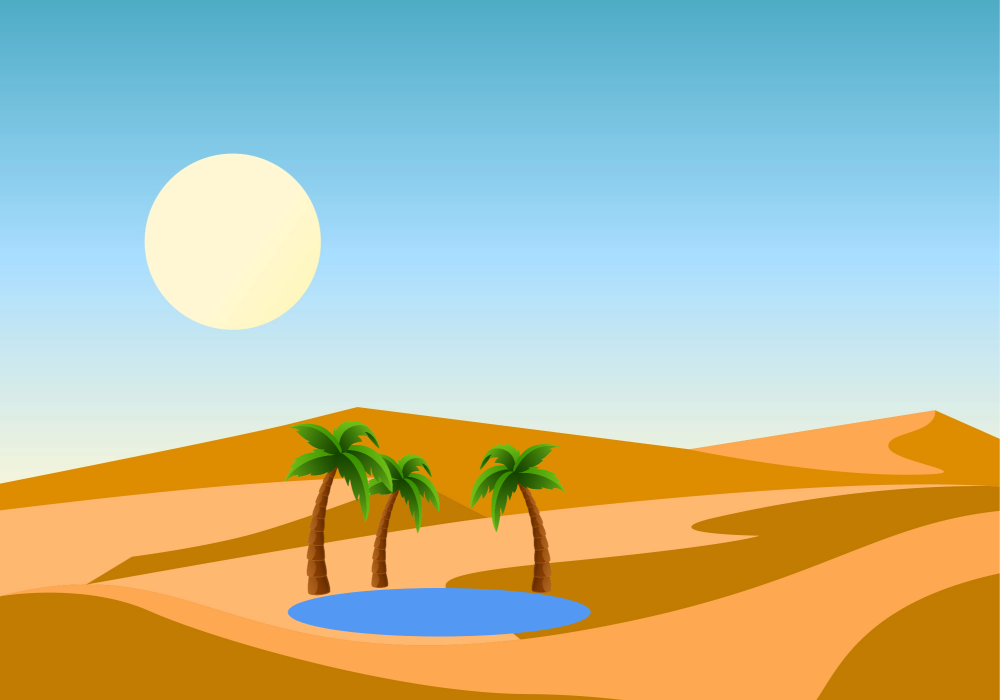
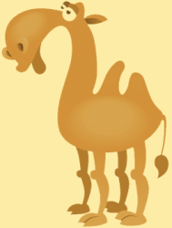
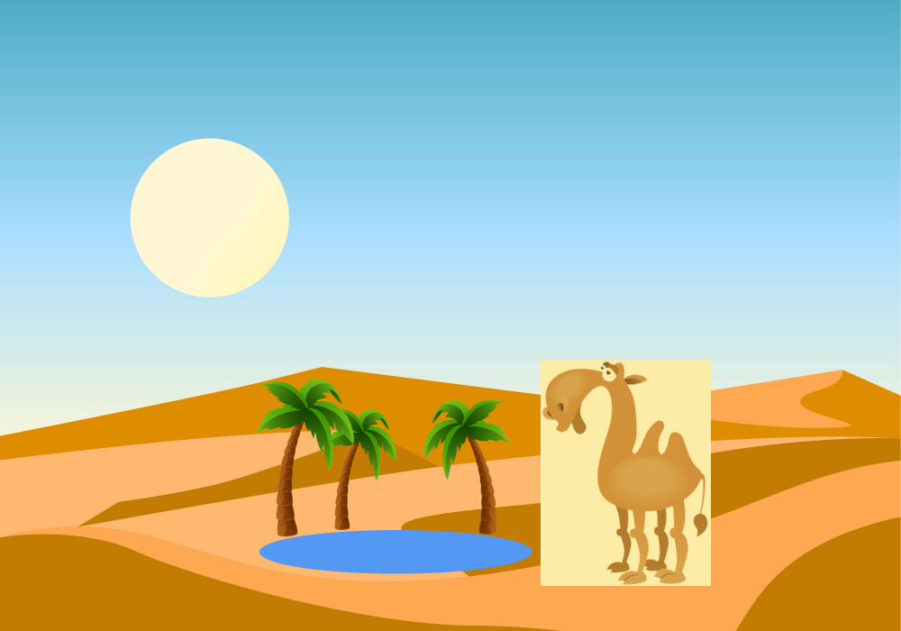
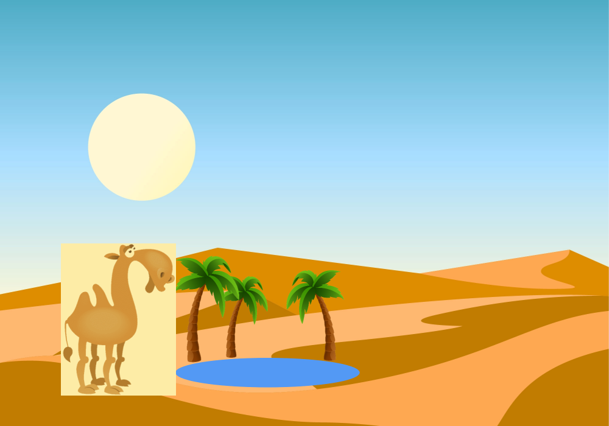

# Оазис

Помогите верблюду оказаться у оазиса с пальмами и озером.

Вашему решению доступны два файла: `оазис (desert.png)` и `верблюд (camel.png)`. Верблюда нужно вставить в файл с оазисом в точку, координаты которой вводятся, предварительно отразив его по горизонтали в случае, если это требуется.





Вводятся координаты точки вставки через пробел, затем вводится строка `reflect`, если нужно отразить, или любая другая, если отражать не нужно.

Оазис со вставленным верблюдом сохраните в файл `happy_camel.png`.

## Пример 1

```
600 400
no
```

Результат работы:



## Пример 2

```
100 400
reflect
```

Результат работы:

