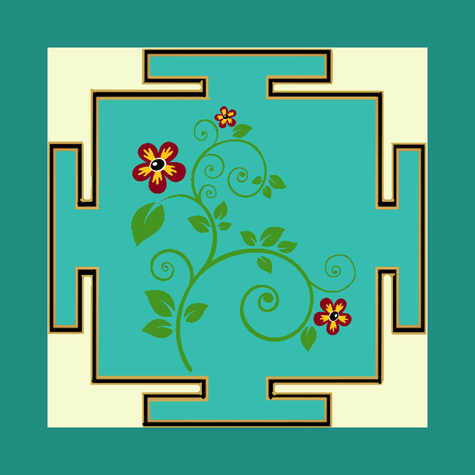

# Растительный орнамент

Художник подготовил эскиз с растительным орнаментом для размещения на плитках разного размера. Измените размер эскиза, чтобы он помещался на квадратной плитке со стороной `s` внутри рамки `s // 10` пикселей, цвет рамки `#208d80`.

## Входные данные

Вводится размер стороны квадратной плитки `s`.

## Выходные данные

Готовое изображение плитки с рамкой и орнаментом сохраните в файл `tile.png`.

## Доступные файлы

*   `ornament.png` - Файл с эскизом орнамента.

## Пример

**Вход:**

```
400
```

**Выход:**

(Файл `tile.png` с результатом)
