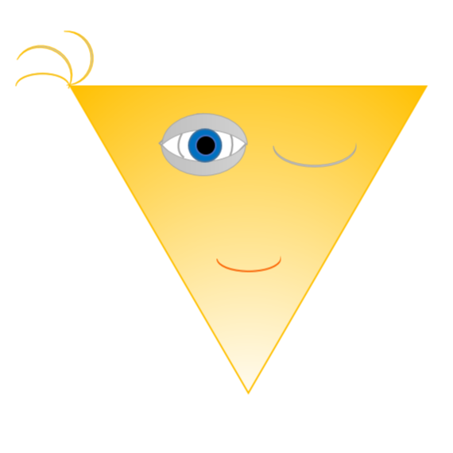
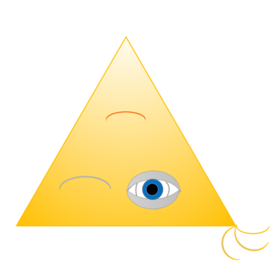

# Отражения

**Ограничение времени:** 1 секунда

**Ограничение памяти:** 64Mb

**Ввод:** стандартный ввод или `input.txt`

**Вывод:** стандартный вывод

В зависимости от того, как вы поставите зеркало (или зеркала!), вы можете получить разные отражения.

Напишите функцию `reflect()`, которая отражает изображения по-разному.

Функция принимает имя картинки и именованный аргумент `kind` – тип отражения, по умолчанию 1.

Возможные типы отражений:

*   1 – отразить по вертикали относительно горизонтальной оси (верх поменять местами с низом);
*   2 – отразить по горизонтали относительно вертикальной оси (право и лево поменять местами);
*   3 – повернуть вокруг центральной точки на 180 градусов.

Полученное изображение сохранить в файл с именем `result.png`.

**Формат ввода**

Пример ввода:

```
reflect("example.png", 3)
```

Для рисунка:



**Формат вывода**

Файл `result.png`:

