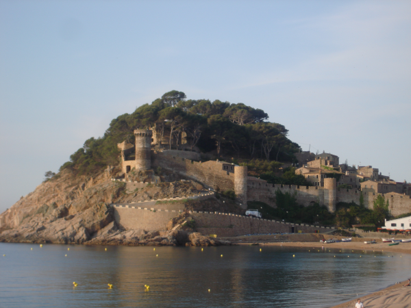

# Меньше разнообразия

**Ограничение времени:** 2 секунды

**Ограничение памяти:** 128Mb

**Ввод:** стандартный ввод или `input.txt`

**Вывод:** стандартный вывод

Когда картинка очень большая, ее бывает трудно передать, долго загружать, да и не всегда нужно слишком высокое качество изображения.

Напишите функцию `less_variety()`, которая уменьшит изображение в 2 раза по ширине и по высоте и уменьшит количество используемых цветов. Функция принимает название файла с изображением и название файла для сохранения.

Количество цветов найти так: определить, сколько различных цветов в исходном файле, затем делить это число на 2, пока не получится число, не превосходящее 256 (применяется целочисленное деление).

## Формат ввода

Пример вызова функции:

```
less_variety("castle.png", "out.png")
```

Для рисунка:



## Формат вывода

Файл `out.png`:

