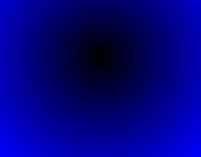

# Переход цвета

**Ограничение времени:** 1 секунда

**Ограничение памяти:** 64Mb

**Ввод:** стандартный ввод или `input.txt`

**Вывод:** стандартный вывод

В библиотеке Image есть возможность создать плавный переход цвета – линейный градиент или круговой. Только там создается черно-белый градиент и размер 256 на 256 пикселей. Напишите функцию `color_gradient()`, которая, воспользовавшись этими функциями даст больше возможностей для творчества.

Функция принимает:

*   имя файла для сохранения полученного изображения (`str`);
*   кортеж из 4-х чисел – координаты верхнего левого и правого нижнего углов прямоугольника для вырезания из полученного градиента (`tuple`);
*   именованный аргумент `kind` для выбора типа градиента (`str`, `linear` или `radial`), по умолчанию `linear` (линейный);
*   именованный аргумент `color` – цвет (`str`, `r`, `g` или `b`), по умолчанию `r`.

Функция должна создать градиент указанного цвета, вырезать из него указанный прямоугольник и сохранить в указанный файл.

## Формат ввода

Пример вызова:

```python
color_gradient("res.png", (0, 56, 256, 256), kind="radial", color="b")
```

## Формат вывода

Файл `res.png`:



## Примечания

Создать линейный градиент серого цвета можно, например, так:

```python
Image.linear_gradient("L")
```